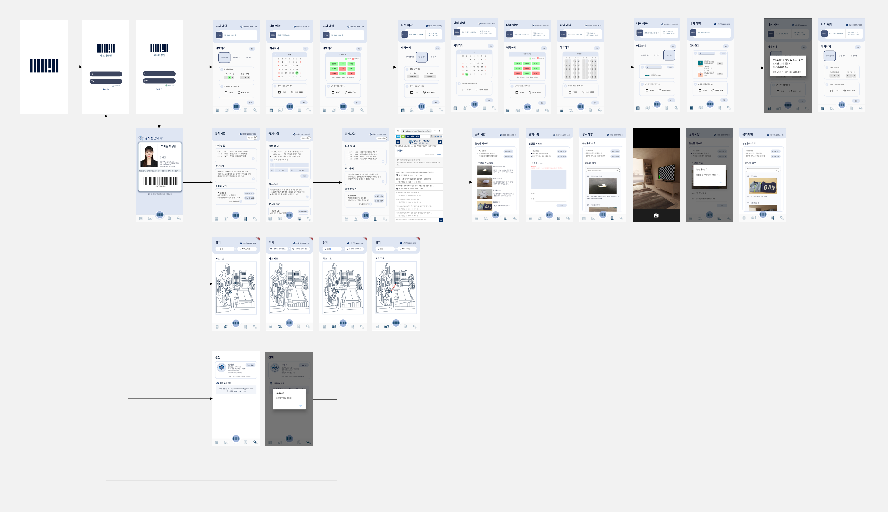

# 에브리띵전     
## Myongji Mobile Student ID  
> 프로젝트 기간 : 20.10.12 ~ 20.11.27  
> 교내 대회 <MJC 학습동아리> 작품 출품 및 대상 수상


```
📌 실물 학생증 및 학교 시스템의 불편한 점을 개선하여 편리한 학교 생활을 도와줍니다.

📌 신입생들을 위해 학교 내 지름길 검색 서비스를 제공합니다.

📌 자신의 마일리지 등 학교 내 서비스를 실시간으로 확인할 수 있습니다.

📌 도서 관련 서비스와 함께 분실물 찾기 등 다양한 서비스를 제공합니다.  
```

## TEAM (Developer) 👩🏻‍💻👨🏻‍💻
- 김수정 - [suzumsz](https://github.com/suzumsz)  
- 양혜원 - [hhyewon](https://github.com/hhyewon)  
- 이보라 - [aroob6](https://github.com/aroob6)  
- 김진원 - [hdev1004](https://github.com/hdev1004)  

## 기능소개 
|  담당자  |   기능설명   |   구현여부   |                              
| :----------: | :----------------: | :----------: |
|김수정| 로그인/로그아웃, DB연동, 메인/하단바/지도화면 구현  | ⭕ |
|양혜원| url연결, firebase연동, 로그인/설정화면 구현 | ⭕ |
|이보라| 바코드,애니메이션 효과, 예약화면 구현 | ⭕ |
|김진원| 사진 기능, 공지사항화면 구현 | ⭕ |

## Workflow




## 개발환경
      
  

## 참고
✔ 결과물 구동은 [시연동영상](/etc/에브리띵전_앱동영상.mp4) 참고  
✔ 에브리띵전 [계획서/주차별 보고서](/etc/계획서_보고서/) 및 [최종보고서](/etc/최종보고서/)  
✔ [에브리띵전 홍보용 판넬](/etc/에브리띵전_판넬.jpg)   
✔ 교내 대회 - [대상 수상](/etc/상장.pdf)   

<details>
<summary> 다운로드 및 실행 </summary>
<div markdown="1">

```
git clone 주소복사
npm install
```

```
flutter run
```

</div>
</details>
